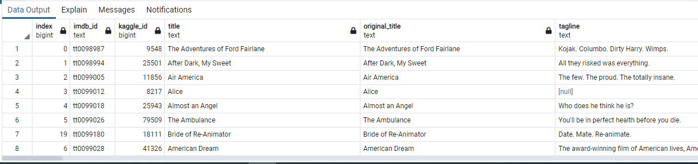
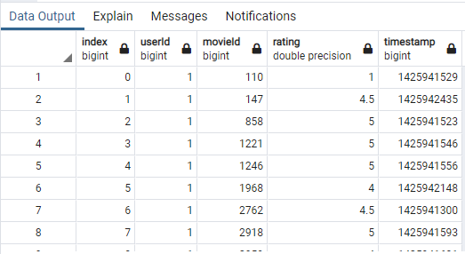

# Movies-ETL-Challenge

## Purpose
Utilizing the data pipeline process known as as "Extract, Transform, and Load (ETL)." This core concept ensures that data is cleaned, consistent, and ready for analysis. The purpose of the ETL is to move information between databases while also maintaining it's integrity and maximizing efficiency of data wrangling. 

In this process, the ETL process will be used to assess movie data and it's associated movie ratings. This information will be beneficial to realize information for which low budget movies will eventually become popular for an online retail business. The data is downloaded, inspected, processed, and then loaded into a stored SQL database for further analysis.

## Results 

There are four deliverables with respect to this project:

1. First, a function will be generated that can read three different data files. The data includes the movie metadata as provided by Kaggle, MovieLens ratings CSV files, and JSON files from Wikipedia. The code is developed so that it converts the information held in these files into a Pandas Dataframe. The DataFrames are then displayed for inspection purposes.

2. The second deliverable requires using Python, Pandas, the ETL process, and code refactoring from Deliverable 1, to extract and transform the Wikipedia data so that it can merge with the Kaggle metadata. While extracting the IMDb IDs using a regular expression string and dropping duplicates, a try-except block was used to catch errors. Much of this data was not consistent, contained erroneous objects, and required using regular expressions to maintain various elements of the displayed columns. Once the data was cleaned, the provided output included a updated DataFrame for each of the movies.

3. The third deliverable requires using Python, Pandas, the ETL process, and code refactoring from Deliverable 1 & 2, to extract and transform the Kaggle data and MovieLens rating data, so that it can merge with the Wikipedia data. While extracting the missing data used regular expressions to fill the missing spots, a try-except block was used to catch errors. Much of this data was not consistent, contained erroneous objects, and required using regular expressions to maintain various elements of the displayed columns. Once the data was cleaned, the provided output included a fully merged DataFrame with all three sets combined.

4. The third deliverable requires using Python, Pandas, the ETL process, and code refactoring from Deliverable 1,2, & 3, to extract and transform the movie DataFrame into a usable Database in SQL. Since the ratings data was too large to import in one statement, it had to be divided into "chunks" of data. To do so, it was necessary to reimport the CSV using the `chunksize=` parameter in `read_csv()`. Doing so, creates an iterable object, which leads to a `for` loop that can append the chunks of data to the new rows to the target SQL table. Given the time factor associated with this, additional code was added to print out how many rows have been imported and time has elapsed. 

   After the program finished, a query was run on the PostgreSQL database to retreive the number of rows for the movies and ratings tables. It was confirmed that the movies table has 6,052 rows and the ratings table has 26,024,289 rows, see below for a screenshot of each query and the output.

 

Movie Query (Rows 8 of 6,052)

 

Ratings Query (Rows 8 of 26,024,289)